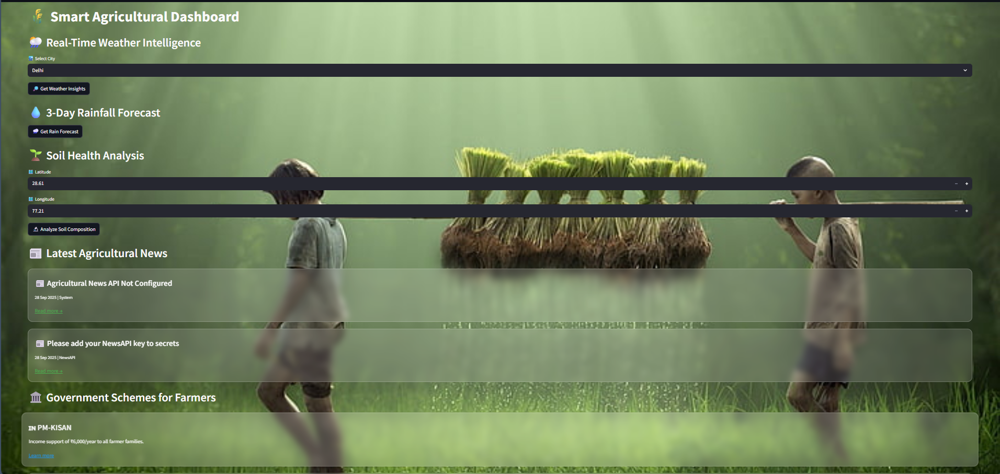
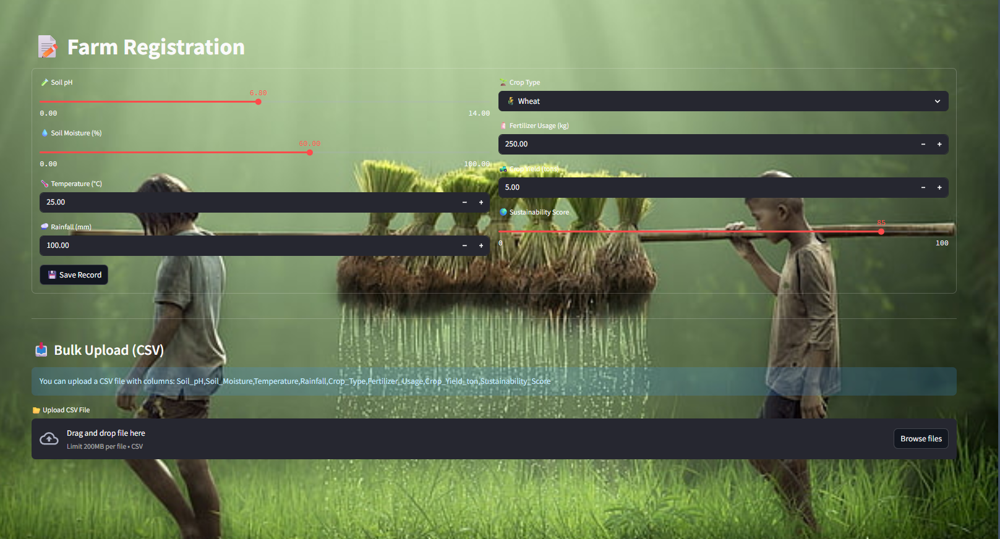
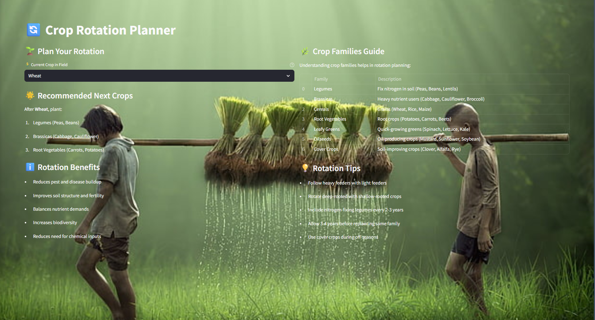
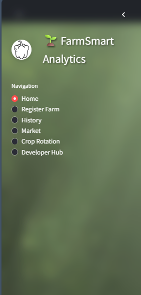
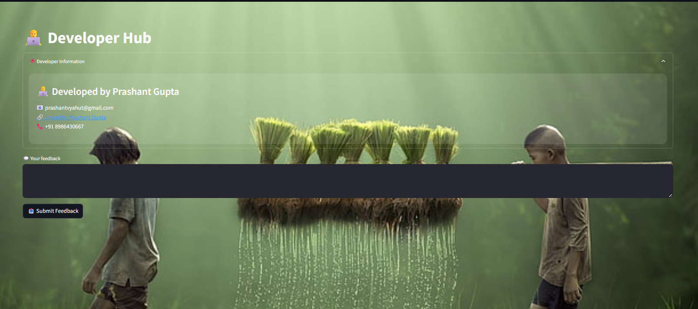

🌾 Farmer Management System
-----------------------------------------------------------------------------------------------
FarmSmart Analytics is a comprehensive, interactive Streamlit-based web application designed to empower farmers and agricultural professionals with data-driven insights for sustainable farm management. The platform integrates real-time weather, soil health, crop market prices, pest risk, government schemes, and AI-powered recommendations to help users make informed decisions and improve crop yield and sustainability.

Key Features
*Farm Registration & Data Management:
Register new farms, record essential field and crop data, and manage historical records with an interactive data editor.

*AI-Powered Suggestions:
Uses the Ollama Phi3 model to analyze farm data and provide actionable, concise recommendations for improving sustainability and yield.

*Weather & Rainfall Forecasts:
Access real-time weather intelligence and 3-day rainfall forecasts for major Indian cities.

*Soil Health Analysis:
Get instant soil composition metrics and tailored recommendations for soil improvement.

*Market & Pest Dashboard:
View current crop prices and pest risk levels, along with practical pest management tips.

*Crop Rotation Planner:
Plan effective crop rotations with guidance on crop families, rotation benefits, and best practices.

Government Schemes & News:
Stay updated with the latest agricultural news and government schemes relevant to Indian farmers.
Developer Hub & Feedback:
Learn about the developer and submit feedback directly through the app.
-----------------------------------------------------------------------------------------------
Technical Highlights
*Modular Code Structure:
All major functionalities (database, AI, APIs) are modularized for maintainability and scalability.

*Modern UI/UX:
Uses custom CSS for a visually appealing, user-friendly interface.

*Secure Secrets Handling:
API keys and sensitive data are managed securely using Streamlit secrets.

*Bulk Data Upload:
Supports CSV uploads for efficient bulk farm data entry.
-----------------------------------------------------------------------------------------------
This application is ideal for farmers, agri-entrepreneurs, and researchers seeking a unified, intelligent platform for smart agriculture management in India.

-----------------------------------------------------------------------------------------------
**Dashboard**

-----------------------------------------------------------------------------------------------
***Farm Registration**

-----------------------------------------------------------------------------------------------
**Crop planner**

-----------------------------------------------------------------------------------------------
**Sidebar**
-----------------------------------------------------------------------------------------------

-----------------------------------------------------------------------------------------------
**Developer Hub**

-----------------------------------------------------------------------------------------------

**If any update kindly refer my linkedIn and comment me any update that I can do here.**

